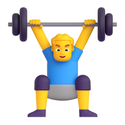

  
    
  <picture>
    <source media="(prefers-color-scheme: dark)" srcset="https://cdn.jsdelivr.net/gh/sun0225SUN/sun0225SUN/assets/images/coding.gif" />
    <source media="(prefers-color-scheme: light)" srcset="https://cdn.jsdelivr.net/gh/sun0225SUN/sun0225SUN/assets/images/developer.svg" height="225px" />
    
  </picture>

 

# 🙋 Hello
<table>
<tr><td>

<h3>🤺 About Me </h3>

<ul><li>
Here is Han 🌻
<li><strong>上海科技大学</strong>&emsp;大一  CS 专业在读
<li>热爱
<table style="margin-left: 6%; margin-right: auto;"><tr><td> 🌱 编程 </td>
<td>📷 摄影</td>
<td>🏸 羽毛球</td>
<td>🏃 跑步 </td>
</tr>
</table>

<li>热爱计算机科学和IT互联网事业，希望能成为一名优秀的开发者,目前方向不定。</ul>

<strong>&emsp;&emsp;We're making the world a better place. Through constructing elegant hierarchies for maximum code reuse and extensibility.</strong>

</td></tr>
</table>

 

 
 

   
<!--  -->

<!-- -->

<!--
  
-->

  <!--
    
  -->

<!-- programming tool icon 编程工具图标 -->
<h3 align="left">📊正在使用工具</h3>
 
<h3 align="left">📅正在学习使用工具</h3>
 
 

<h2 style="font-szie: 30px;">Tools</h2>

  
<!-- svg -->

 

 
  
<!-- gif -->

<!--The end -->
     

<!--
**wangzh12023/wangzh12023** is a ✨ _special_ ✨ repository because its `README.md` (this file) appears on your GitHub profile.

Here are some ideas to get you started:

- 🔭 I’m currently working on ...
- 🌱 I’m currently learning ...
- 👯 I’m looking to collaborate on ...
- 🤔 I’m looking for help with ...
- 💬 Ask me about ...
- 📫 How to reach me: ...
- 😄 Pronouns: ...
- ⚡ Fun fact: ...
-->

