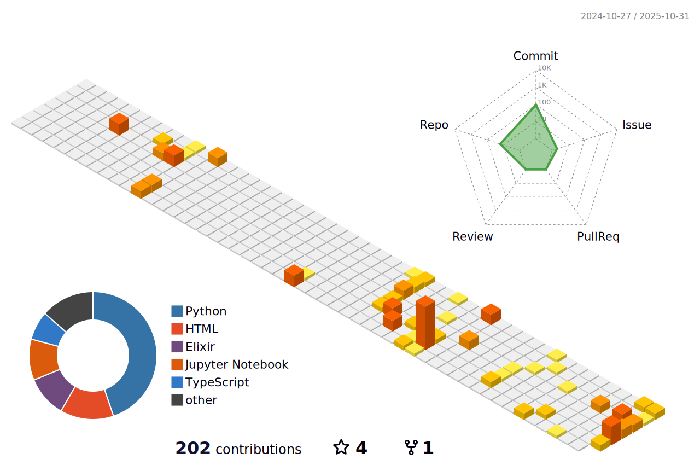

  
    
  <picture>
    <source media="(prefers-color-scheme: dark)" srcset="https://cdn.jsdelivr.net/gh/sun0225SUN/sun0225SUN/assets/images/coding.gif" />
    <source media="(prefers-color-scheme: light)" srcset="https://cdn.jsdelivr.net/gh/sun0225SUN/sun0225SUN/assets/images/developer.svg" height="225px" />
    
  </picture>

 

# Hi there 👋

- 🙋 Hi, I’m Zihan Wang, a junior undergraduate student majoring in Computer Science  at ShanghaiTech University. 
-  🔭 I’m currently working on **LLM** and **NLP**, focusing on transformer-based reasoning and **Chain-of-Thought(CoT)** research, a direction I'm pursuing under the supervision of Professor [KeWei Tu](https://faculty.sist.shanghaitech.edu.cn/faculty/tukw/).
- 🌱 I’m currently learning  **CoT reasoning techniques**, Optimization theory, including **numerical optimization** and **convex optimization**. and in the future I want to explore the integration of syntactic/semantic parsing  with modern NLP models.
- 🤝 Currently, I am working in Professor [Kewei Tu's Lab](https://faculty.sist.shanghaitech.edu.cn/faculty/tukw/) at ShanghaiTech University. 
- 🤝 Previously, during my sophomore year, I worked in the [VRVC-MARS](https://vic.shanghaitech.edu.cn/vrvc/en/) at ShanghaiTech University, where I briefly engaged in 3D point cloud and mesh processing, dataset construction, YOLO-based visual detection, etc.
- 🧩 I’ve also participated in [GeekPie](https://geekpie.club/),  where I developed small **frontend–backend** projects and explored full-stack skills during my freshman year.
- 💬 I’m currently a Teaching Assistant for *GEMA1001 (Calculus)* at ShanghaiTech. Feel free to ask me questions.
- 📫 You can reach me at **[wangzh12023@shanghaitech.edu.cn](mailto:wangzh12023@shanghaitech.edu.cn)** or **[3350782760@qq.com](mailto:3350782760@qq.com)**
- 🎨 Outside of academics, I enjoy running🏃, badminton🏸, mathematics, and photography📷,  you can find my photo collections on [Xiaohongshu](https://xhslink.com/m/1ymZTTZ8ESQ) or [500px](https://500px.com.cn/Hiberge). 

 

 
 

<!-- 

 -->

<!-- svg -->
<!-- 

 

 
  

 -->

<!--  -->
<!--The end -->

 

